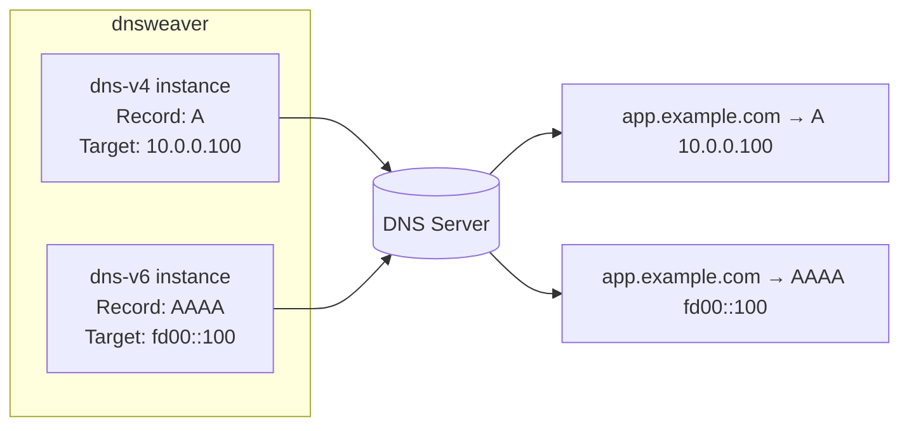

# Dual-Stack DNS (A + AAAA)

Dual-stack DNS provides both IPv4 (A) and IPv6 (AAAA) records for the same hostname, enabling clients to connect over whichever protocol is available.

## How It Works

dnsweaver treats each provider instance independently. To create both A and AAAA records for the same hostnames, configure two instances pointing to the same DNS provider with different record types and targets:



## Configuration

### Environment Variables

```yaml
environment:
  - DNSWEAVER_INSTANCES=dns-v4,dns-v6

  # IPv4 records
  - DNSWEAVER_DNS_V4_TYPE=technitium
  - DNSWEAVER_DNS_V4_URL=http://dns-server:5380
  - DNSWEAVER_DNS_V4_TOKEN_FILE=/run/secrets/dns_token
  - DNSWEAVER_DNS_V4_ZONE=example.com
  - DNSWEAVER_DNS_V4_RECORD_TYPE=A
  - DNSWEAVER_DNS_V4_TARGET=10.0.0.100
  - DNSWEAVER_DNS_V4_DOMAINS=*.example.com

  # IPv6 records
  - DNSWEAVER_DNS_V6_TYPE=technitium
  - DNSWEAVER_DNS_V6_URL=http://dns-server:5380
  - DNSWEAVER_DNS_V6_TOKEN_FILE=/run/secrets/dns_token
  - DNSWEAVER_DNS_V6_ZONE=example.com
  - DNSWEAVER_DNS_V6_RECORD_TYPE=AAAA
  - DNSWEAVER_DNS_V6_TARGET=fd00::100
  - DNSWEAVER_DNS_V6_DOMAINS=*.example.com
```

### YAML Config File

```yaml
global:
  log_level: info
  platform: docker

providers:
  dns-v4:
    type: technitium
    url: http://dns-server:5380
    token_file: /run/secrets/dns_token
    zone: example.com
    record_type: A
    target: 10.0.0.100
    domains:
      - "*.example.com"

  dns-v6:
    type: technitium
    url: http://dns-server:5380
    token_file: /run/secrets/dns_token
    zone: example.com
    record_type: AAAA
    target: "fd00::100"
    domains:
      - "*.example.com"
```

Both instances use the same DNS server, zone, and domain patterns — only the record type and target differ.

## Per-Container Overrides

For services that need different IPv6 targets, use native dnsweaver labels:

```yaml
services:
  special-app:
    image: myapp:latest
    labels:
      - "traefik.http.routers.app.rule=Host(`app.example.com`)"
      # Override IPv6 target for this specific service
      - "dnsweaver.records.ipv6.hostname=app.example.com"
      - "dnsweaver.records.ipv6.type=AAAA"
      - "dnsweaver.records.ipv6.target=fd00::200"
```

## Combining with Split-Horizon

Dual-stack works alongside [split-horizon DNS](split-horizon.md). Use four instances for full coverage:

```yaml
environment:
  - DNSWEAVER_INSTANCES=internal-v4,internal-v6,external-v4,external-v6

  # Internal IPv4
  - DNSWEAVER_INTERNAL_V4_TYPE=technitium
  - DNSWEAVER_INTERNAL_V4_RECORD_TYPE=A
  - DNSWEAVER_INTERNAL_V4_TARGET=10.0.0.100
  - DNSWEAVER_INTERNAL_V4_DOMAINS=*.example.com
  # ... (URL, zone, token)

  # Internal IPv6
  - DNSWEAVER_INTERNAL_V6_TYPE=technitium
  - DNSWEAVER_INTERNAL_V6_RECORD_TYPE=AAAA
  - DNSWEAVER_INTERNAL_V6_TARGET=fd00::100
  - DNSWEAVER_INTERNAL_V6_DOMAINS=*.example.com
  # ... (URL, zone, token)

  # External IPv4 (Cloudflare)
  - DNSWEAVER_EXTERNAL_V4_TYPE=cloudflare
  - DNSWEAVER_EXTERNAL_V4_RECORD_TYPE=A
  - DNSWEAVER_EXTERNAL_V4_TARGET=203.0.113.50
  - DNSWEAVER_EXTERNAL_V4_DOMAINS=*.example.com
  # ... (token, zone)

  # External IPv6 (Cloudflare)
  - DNSWEAVER_EXTERNAL_V6_TYPE=cloudflare
  - DNSWEAVER_EXTERNAL_V6_RECORD_TYPE=AAAA
  - DNSWEAVER_EXTERNAL_V6_TARGET=2001:db8::50
  - DNSWEAVER_EXTERNAL_V6_DOMAINS=*.example.com
  # ... (token, zone)
```

## IPv6-Only Services

To create AAAA records without A records for specific services, use exclusion patterns:

```yaml
environment:
  - DNSWEAVER_INSTANCES=dns-v4,dns-v6

  # IPv4 - exclude ipv6-only subdomain
  - DNSWEAVER_DNS_V4_DOMAINS=*.example.com
  - DNSWEAVER_DNS_V4_EXCLUDE_DOMAINS=*.v6.example.com

  # IPv6 - all subdomains including v6-only
  - DNSWEAVER_DNS_V6_DOMAINS=*.example.com
```

Services under `*.v6.example.com` get only AAAA records. All others get both A and AAAA.

## Validation

Use the `--validate` flag to verify dual-stack configuration:

```bash
dnsweaver --validate
```

This confirms both instances are configured correctly with matching record types and valid targets (IPv4 for A, IPv6 for AAAA).

## See Also

- [Split-Horizon DNS](split-horizon.md) — different records for internal vs external
- [Native Labels](../sources/native-labels.md) — per-container record overrides
